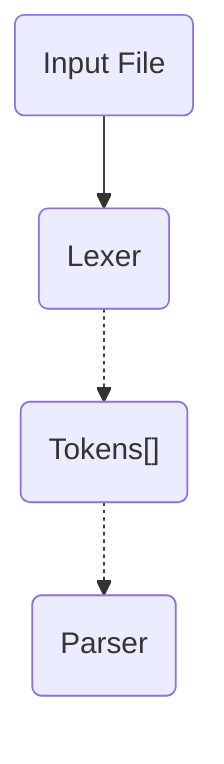
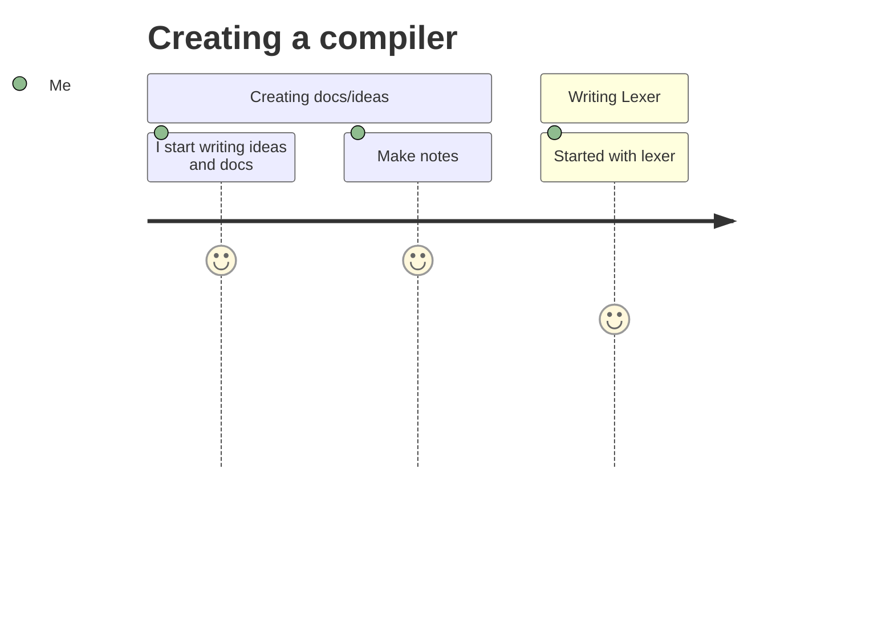

# beetle
Creating a compiler 

## Flow

```mermaid
flowchart TD
A(Input File)-->B(Lexer)-.->C("Tokens[]")-.->D(Parser);
```

<!--
## Journey

```mermaid
journey
	title Creating a compiler
	section Creating docs/ideas
		I start writing ideas and docs:7 : Me
		Make notes: 7: Me
	section Writing Lexer
    Started with lexer: 5: Me
	section Testing
```
